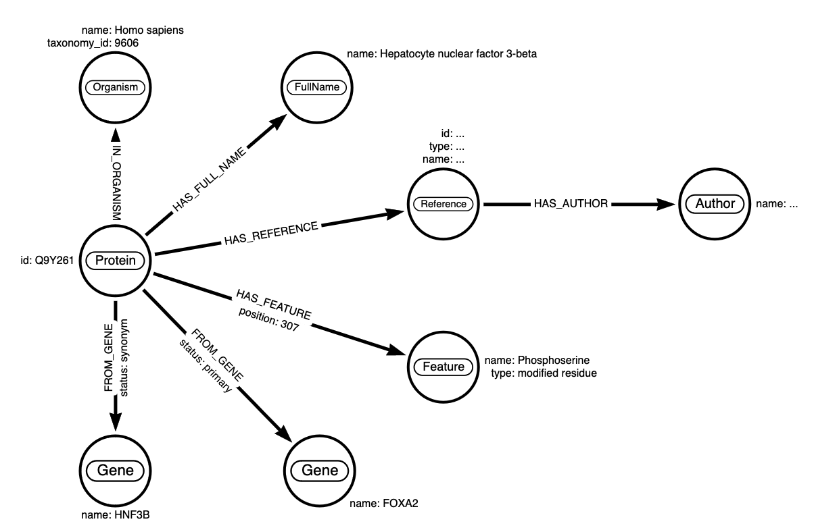

# Data Engineering Coding Challenge

> *tl;dr*: The challenge is to create a data pipeline that will ingest a UniProt XML file (`data/Q9Y261.xml`) and store the data in a Neo4j graph database.

> :warning: To apply, email join@weave.bio with 1) the link to your solution repo and 2) your resume.

## Task
Read the XML file `Q9Y261.xml` located in the `data` directory. The XML file contains information about a protein. The task is to create a data pipeline that will ingest the XML file and store as much information as possible in a Neo4j graph database.

## Requirements & Tools
- Use Apache Airflow or a similar workflow management tool to orchestrate the pipeline
- The pipeline should run on a local machine
- Use open-source tools as much as possible

## Source Data
Please use the XML file provided in the `data` directory. The XML file is a subset of the [UniProt Knowledgebase](https://www.uniprot.org/help/uniprotkb).

The XML contains information about proteins, associdated genes and other biological entities. The root element of the XML is `uniprot`. Each `uniprot` element contains a `entry` element. Each `entry` element contains various elements such as `protein`, `gene`, `organism` and `reference`. Use this for the graph data model.

The full XML schema [is available here](https://ftp.uniprot.org/pub/databases/uniprot/current_release/knowledgebase/complete/uniprot.xsd).

## Neo4j Target Database
Please run a Neo4j database locally. You can download Neo4j from https://neo4j.com/download-center/ or run it in Docker:

```
docker run \
  --publish=7474:7474 --publish=7687:7687 \
  --volume=$HOME/neo4j/data:/data \
  neo4j:latest
```

Getting Started with Neo4j: https://neo4j.com/docs/getting-started/current/


## Data Model
The data model should be a graph data model. The graph should contain nodes for proteins, genes, organisms, references, and more. The graph should contain edges for the relationships between these nodes. The relationships should be based on the XML schema. For example, the `protein` element contains a `recommendedName` element. The `recommendedName` element contains a `fullName` element. The `fullName` element contains the full name of the protein. The graph should contain an edge between the `protein` node and the `fullName` node.

Here is an example for the target data model:




## Assessed Criteria

> :warning: The solution will not be assessed based on correctness of the data model with respect to biological entities. This requires domain knowledge that we do not expect you to have. 

We will assess the solution based on the following criteria:

- The solution captures most of the data from the XML
- The solution makes use of general purpose open-source tools
- The solution can be scaled to handle larger datasets

## Example Code
In the `example_code` directory, you will find some example Python code for loading data to Neo4j.

## Submission
**Please commit your solution to a new repository on GitHub**.

Feel free to use this repository as a starting point or to start from scratch. Include a `README.md` file that describes how to run the solution. 
Please also include a description how to set up and reproduce the environment required to run the solution.

Finally, email join@weave.bio with 1) the link to your solution repo and 2) your resume